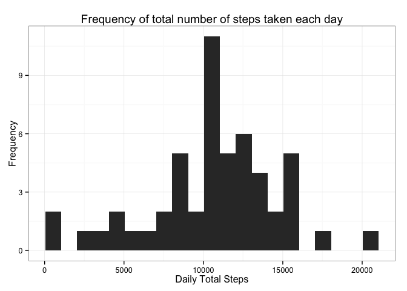

# Reproducible Research: Peer Assessment 1


### Part 1: Loading and preprocessing the data  

1. Load the data (i.e. read.csv()).
2. Process/transform the data (if necessary) into a format suitable for your analysis.

To begin with, let us load our data set.


```r
activity <- read.csv("activity.csv")
```

Let us also take a look at the structure and first few rows.


```r
str(activity)
```

```
## 'data.frame':	17568 obs. of  3 variables:
##  $ steps   : int  NA NA NA NA NA NA NA NA NA NA ...
##  $ date    : Factor w/ 61 levels "2012-10-01","2012-10-02",..: 1 1 1 1 1 1 1 1 1 1 ...
##  $ interval: int  0 5 10 15 20 25 30 35 40 45 ...
```

```r
head(activity)
```

```
##   steps       date interval
## 1    NA 2012-10-01        0
## 2    NA 2012-10-01        5
## 3    NA 2012-10-01       10
## 4    NA 2012-10-01       15
## 5    NA 2012-10-01       20
## 6    NA 2012-10-01       25
```

The date column is a factor; let us convert it to date. 


```r
activity$date <- as.Date(activity$date, format="%Y-%m-%d")
```

Let us have a look again, after this conversion.  


```r
str(activity)
```

```
## 'data.frame':	17568 obs. of  3 variables:
##  $ steps   : int  NA NA NA NA NA NA NA NA NA NA ...
##  $ date    : Date, format: "2012-10-01" "2012-10-01" ...
##  $ interval: int  0 5 10 15 20 25 30 35 40 45 ...
```

```r
head(activity)
```

```
##   steps       date interval
## 1    NA 2012-10-01        0
## 2    NA 2012-10-01        5
## 3    NA 2012-10-01       10
## 4    NA 2012-10-01       15
## 5    NA 2012-10-01       20
## 6    NA 2012-10-01       25
```

### Part 2. What is mean total number of steps taken per day?  

1. Make a histogram of the total number of steps taken each day.    
2. Calculate and report the mean and median total number of steps taken per day.  

Since we have several missing values in our data set, iet us first create a  new data set with only complete cases.  


```r
complete_activity <- activity[complete.cases(activity),]
```

Let us create a summary data set with the total number of steps taken each day.  


```r
daily_summary <- ddply(complete_activity,"date",summarise,totalsteps=sum(steps))
```

Let us also take a look at the structure and first few rows of this data set.


```r
str(daily_summary)
```

```
## 'data.frame':	53 obs. of  2 variables:
##  $ date      : Date, format: "2012-10-02" "2012-10-03" ...
##  $ totalsteps: int  126 11352 12116 13294 15420 11015 12811 9900 10304 17382 ...
```

```r
head(daily_summary)
```

```
##         date totalsteps
## 1 2012-10-02        126
## 2 2012-10-03      11352
## 3 2012-10-04      12116
## 4 2012-10-05      13294
## 5 2012-10-06      15420
## 6 2012-10-07      11015
```

Let us now make the histogram for the total number of steps taken each day.  


```r
ggplot(daily_summary,aes(totalsteps)) +
    geom_histogram(breaks=seq(min(daily_summary$totalsteps),max(daily_summary$totalsteps),by=1000)) +  
    xlab("Daily Total Steps") + ylab("Frequency") + 
    ggtitle("Frequency of total number of steps taken each day") + 
    theme_bw()
```

 

And finally, let us find the mean and median for total number of steps taken per day.  


```r
act_mean_totalsteps <- round(mean(daily_summary$totalsteps),1)
act_mean_totalsteps
```

```
## [1] 10766.2
```

```r
act_median_totalsteps <- round(median(daily_summary$totalsteps),1)
act_median_totalsteps
```

```
## [1] 10765
```

We see that:  
- The mean total number of steps taken per day is 10766.2.  
- And the median total number of steps taken per day is 10765.  

### Part 3. What is the average daily activity pattern?  
1. Make a time series plot (i.e. type = "l") of the 5-minute interval (x-axis) and the average number of steps taken, averaged across all days (y-axis)  
2. Which 5-minute interval, on average across all the days in the dataset, contains the maximum number of steps?

Let us create another summary data set with the average number of steps taken for each interval, averaged across all days.


```r
interval_summary <- ddply(complete_activity,"interval",summarise,avgintervalsteps=mean(steps))
```

Let us also take a look at the structure and first few rows of this data set.


```r
str(interval_summary)
```

```
## 'data.frame':	288 obs. of  2 variables:
##  $ interval        : int  0 5 10 15 20 25 30 35 40 45 ...
##  $ avgintervalsteps: num  1.717 0.3396 0.1321 0.1509 0.0755 ...
```

```r
head(interval_summary)
```

```
##   interval avgintervalsteps
## 1        0        1.7169811
## 2        5        0.3396226
## 3       10        0.1320755
## 4       15        0.1509434
## 5       20        0.0754717
## 6       25        2.0943396
```

Let us now create the line plot.  


```r
ggplot(interval_summary,aes(interval,avgintervalsteps)) + 
    geom_line() +
    xlab("Intervals") + ylab("Average number of steps") + 
    ggtitle("Average number of steps for each interval") + 
    theme_bw()
```

 

Now let us find out which 5-minute interval, on average across all the days in the dataset, contains the maximum number of steps. For this, let us sort our dataset in the descending order and pick the first interval.  


```r
sorted_interval_summary <- arrange(interval_summary,desc(avgintervalsteps))
best_interval <- sorted_interval_summary[1,1]
best_interval
```

```
## [1] 835
```

We see that the best interval, which contains the maximum number of steps on average is 835.

### Part 4. Imputing missing values
1. Calculate and report the total number of missing values in the dataset (i.e. the total number of rows with NAs)
2. Devise a strategy for filling in all of the missing values in the dataset. The strategy does not need to be sophisticated. For example, you could use the mean/median for that day, or the mean for that 5-minute interval, etc.
3. Create a new dataset that is equal to the original dataset but with the missing data filled in.
4. Make a histogram of the total number of steps taken each day and Calculate and report the mean and median total number of steps taken per day. Do these values differ from the estimates from the first part of the assignment? What is the impact of imputing missing data on the estimates of the total daily number of steps?

Let us find out the number of missing values for each column first, before finding the number of incomplete rows.


```r
na_steps <- sum(is.na(activity$steps))
na_steps
```

```
## [1] 2304
```

```r
na_date <- sum(is.na(activity$date))
na_date
```

```
## [1] 0
```

```r
na_interval <- sum(is.na(activity$interval))
na_interval
```

```
## [1] 0
```

We see that:  

- Number of missing values for steps = 2304  
- Number of missing values for date = 0  
- Number of missing values for interval = 0    

Since there are no missing values for date or interval, the number of incomplete rows is also 2304.  

Now let us fill in all the missing values (as we saw, for steps). Let us create a copy of our data set and fill in that, so that we have the original with us in case we need it later. We will use the average value of steps for that interval (which we have already computed) for filling in the missing data. 


```r
assign("imputed_activity",activity)
for(i in 1:nrow(imputed_activity)){
    if(is.na(imputed_activity[i,1])){
		interval_idx <- ((60*(imputed_activity[i,3] %/% 100) + (imputed_activity[i,3] %% 100))/5) + 1
		imputed_activity[i,1] <- interval_summary[interval_idx,2]
	}
}
```

Let us see the structure and the first few rows of the new data set.


```r
str(imputed_activity)
```

```
## 'data.frame':	17568 obs. of  3 variables:
##  $ steps   : num  1.717 0.3396 0.1321 0.1509 0.0755 ...
##  $ date    : Date, format: "2012-10-01" "2012-10-01" ...
##  $ interval: int  0 5 10 15 20 25 30 35 40 45 ...
```

```r
head(imputed_activity)
```

```
##       steps       date interval
## 1 1.7169811 2012-10-01        0
## 2 0.3396226 2012-10-01        5
## 3 0.1320755 2012-10-01       10
## 4 0.1509434 2012-10-01       15
## 5 0.0754717 2012-10-01       20
## 6 2.0943396 2012-10-01       25
```

We can see in the first few rows itelf that the missing values no longer appear. To be sure, let us check if there are any more missing values for steps.


```r
na_steps_new <- sum(is.na(imputed_activity$steps))
na_steps_new
```

```
## [1] 0
```

We can see that the missing values for steps have now become 0.  

Now let us create a summary data set with the total number of steps taken each day, using the imputed data set. 


```r
daily_summary_imputed <- ddply(imputed_activity,"date",summarise,totalsteps=sum(steps,na.rm=TRUE))
```

Let us also take a look at the structure and first few rows of this data set.


```r
str(daily_summary_imputed)
```

```
## 'data.frame':	61 obs. of  2 variables:
##  $ date      : Date, format: "2012-10-01" "2012-10-02" ...
##  $ totalsteps: num  10766 126 11352 12116 13294 ...
```

```r
head(daily_summary_imputed)
```

```
##         date totalsteps
## 1 2012-10-01   10766.19
## 2 2012-10-02     126.00
## 3 2012-10-03   11352.00
## 4 2012-10-04   12116.00
## 5 2012-10-05   13294.00
## 6 2012-10-06   15420.00
```

Let us now make the histogram for the total number of steps taken each day.  


```r
ggplot(daily_summary_imputed,aes(totalsteps)) +
    geom_histogram(breaks=seq(min(daily_summary_imputed$totalsteps),max(daily_summary_imputed$totalsteps),by=1000)) +  
    xlab("Daily Total Steps") + ylab("Frequency") + 
    ggtitle("Frequency of total number of steps taken each day") + 
    theme_bw()
```

 

And finally, let us find the mean and median for total number of steps taken per day.  


```r
act_mean_totalsteps_imputed <- round(mean(daily_summary_imputed$totalsteps),1)
act_mean_totalsteps_imputed
```

```
## [1] 10766.2
```

```r
act_median_totalsteps_imputed <- round(median(daily_summary_imputed$totalsteps),1)
act_median_totalsteps_imputed
```

```
## [1] 10766.2
```

After imputing, we see that:  
- The new mean total number of steps taken per day is 10766.2.   
- And the new median total number of steps taken per day is 10766.2.  

While the mean has remained same before and after imputing, median has increased very slightly.  

### Part 5. Are there differences in activity patterns between weekdays and weekends?  

1. Create a new factor variable in the dataset with two levels -- "weekday" and "weekend" indicating whether a given date is a weekday or weekend day.  
2. Make a panel plot containing a time series plot (i.e. type = "l") of the 5-minute interval (x-axis) and the average number of steps taken, averaged across all weekday days or weekend days (y-axis).  

Let us first introduce a new column, daytype, indicating whether a day is a weekday or not.


```r
imputed_activity <- mutate(imputed_activity, 
                           daytype = ifelse(
                               weekdays(imputed_activity$date) == "Saturday"
                               | weekdays(imputed_activity$date) == "Sunday", 
                               "weekend", "weekday"))
imputed_activity$daytype <- as.factor(imputed_activity$daytype)
```

Let us see the structure and the first few rows of the modified data set.


```r
str(imputed_activity)
```

```
## 'data.frame':	17568 obs. of  4 variables:
##  $ steps   : num  1.717 0.3396 0.1321 0.1509 0.0755 ...
##  $ date    : Date, format: "2012-10-01" "2012-10-01" ...
##  $ interval: int  0 5 10 15 20 25 30 35 40 45 ...
##  $ daytype : Factor w/ 2 levels "weekday","weekend": 1 1 1 1 1 1 1 1 1 1 ...
```

```r
head(imputed_activity)
```

```
##       steps       date interval daytype
## 1 1.7169811 2012-10-01        0 weekday
## 2 0.3396226 2012-10-01        5 weekday
## 3 0.1320755 2012-10-01       10 weekday
## 4 0.1509434 2012-10-01       15 weekday
## 5 0.0754717 2012-10-01       20 weekday
## 6 2.0943396 2012-10-01       25 weekday
```

Let us create another summary data set with the average number of steps taken for each interval, averaged across all days.


```r
interval_summary_imputed <- ddply(imputed_activity,c("interval","daytype"),summarise,avgintervalsteps=mean(steps))
```

Let us also take a look at the structure and first few rows of this data set.


```r
str(interval_summary_imputed)
```

```
## 'data.frame':	576 obs. of  3 variables:
##  $ interval        : int  0 0 5 5 10 10 15 15 20 20 ...
##  $ daytype         : Factor w/ 2 levels "weekday","weekend": 1 2 1 2 1 2 1 2 1 2 ...
##  $ avgintervalsteps: num  2.2512 0.2146 0.4453 0.0425 0.1732 ...
```

```r
head(interval_summary_imputed)
```

```
##   interval daytype avgintervalsteps
## 1        0 weekday       2.25115304
## 2        0 weekend       0.21462264
## 3        5 weekday       0.44528302
## 4        5 weekend       0.04245283
## 5       10 weekday       0.17316562
## 6       10 weekend       0.01650943
```

Let us now create the panel plot.  


```r
ggplot(interval_summary_imputed,aes(interval,avgintervalsteps)) +
    geom_line() + facet_wrap(~daytype, ncol = 1, nrow=2) + 
    xlab("Intervals") + ylab("Average number of steps") + 
    ggtitle("Average number of steps for each interval") + 
    theme_bw()
```

 

From the plot, we see that during weekdays, the activities are more concentrated in the mornings, while on weekends, they are more spreadout through the day by comparison.
